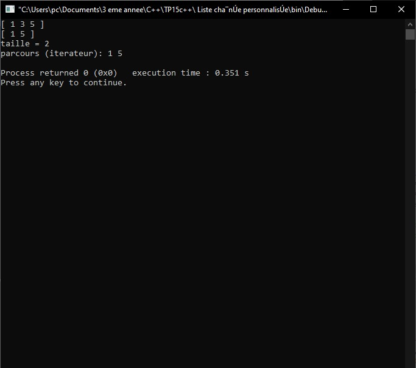
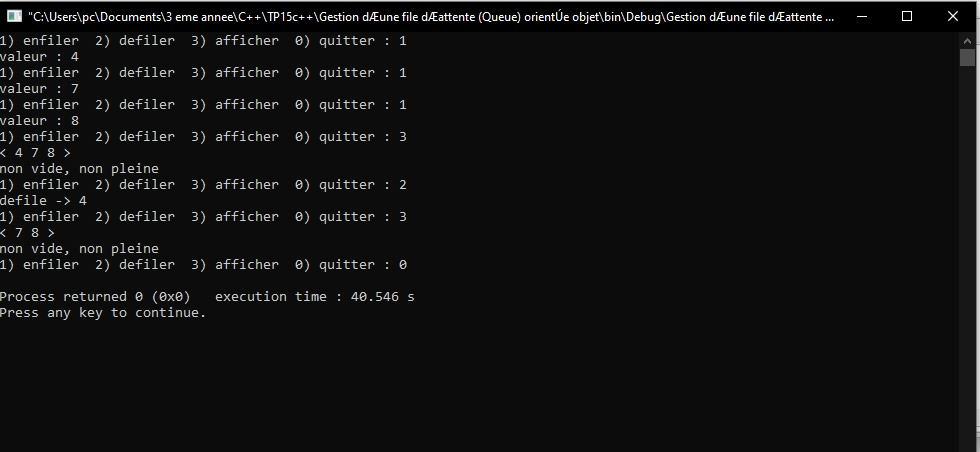
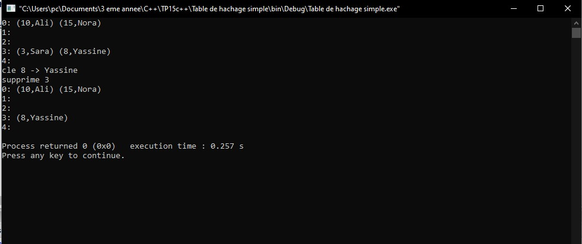
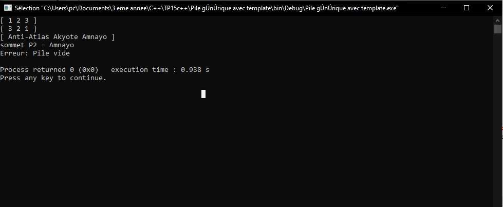

# TP15 — Structures de données orientées objet (C++)
Cours : Programmation Orientée Objet — C++

## Objectifs
- Implémenter des structures classiques (liste chaînée, file, table de hachage, pile) en C++.
- Pratiquer l’encapsulation, la gestion de mémoire et les exceptions.
- Utiliser des modèles (templates) pour la généricité.

---
````
TP15c++/
├─ Liste chaînée personnalisée/
│ └─ main.cpp
├─Gestion d’une file d’attente (Queue) orientée objet/
│ └─ main.cpp
├─Table de hachage simple/
│ └─ main.cpp
├─ Pile générique avec template/
│ └─ main.cpp
├─ image
└─ README.md
```` 
## Exercice 1 — Liste chaînée personnalisée
### Spécifications
- `struct Noeud { int valeur; Noeud* suivant; };`
- `class ListeChainee` :
  - `void ajouterDebut(int v)`
  - `void ajouterFin(int v)`
  - `bool supprimer(int v)` (retourne vrai si supprimé)
  - `void afficher() const`
  - `size_t taille() const`
  - Destructeur qui libère toute la liste
  - **Bonus** : itérateur minimal pour `for(int x : liste)`


### Résultat visuel

<div align="center">  <p><em>Figure 1</em></p> </div> 

### Points clés
- Gérer proprement les pointeurs (insertion tête/fin, suppression milieu).
- Mettre le compteur à jour.
- Désallouer dans le destructeur ou via une méthode `vider()`.

---

## Exercice 2 — File d’attente (FIFO) orientée objet
### Spécifications
- Implémentation via maillons (ou tableau dynamique).
- `class File` :
  - `void enfiler(int v)`
  - `int defiler()` (lève une exception si vide)
  - `bool estVide() const`, `bool estPleine() const` (si capacité fixée)
  - `void afficher() const`
- Petite interface texte pour tester.
  
### Résultat visuel

<div align="center">  <p><em>Figure 2</em></p> </div>

### Points clés
- Mise à jour cohérente de `head`, `tail` et du compteur.
- Lever `std::runtime_error` sur défilement d’une file vide.

---

## Exercice 3 — Table de hachage (chaînage)
### Spécifications
- `class TableHachage` avec `vector<list<pair<int,string>>>`.
- Hachage : `index = cle % taille`.
- Méthodes :
  - `void inserer(int cle, const string& valeur)` (mise à jour si clé existe)
  - `string* rechercher(int cle)` (retourne pointeur ou `nullptr`)
  - `bool supprimer(int cle)`
  - `void afficher() const` (montre toutes les cases et collisions)
- Optionnel : redimensionnement.

### Résultat visuel
<div align="center">  <p><em>Figure 3</em></p> </div>

### Points clés
- Parcours propre des listes pour insérer/mettre à jour/supprimer.
- Affichage clair des collisions.

---

## Exercice 4 — Pile générique (template) + inversion
### Spécifications
- `template<class T> class Pile` basé sur `std::vector<T>`.
- Méthodes :
  - `void empiler(const T& e)`
  - `T depiler()` (exception si vide)
  - `const T& sommet() const` (exception si vide)
  - `bool estVide() const`
  - `void inverser()` (inverse l’ordre des éléments)
  - `void afficher() const`
- Tests avec `int`, `string`, `double`.

###  Résultat visuel

<div align="center">  <p><em>Figure 4</em></p> </div>

### Points clés
- Exceptions sur accès à une pile vide (`std::runtime_error`).
- Inversion en place par échanges symétriques.

---

## Compilation (exemples)
Avec g++ :
```bash
g++ -std=c++17 -O2 -Wall Liste chaînée personnalisée/main.cpp -o 

